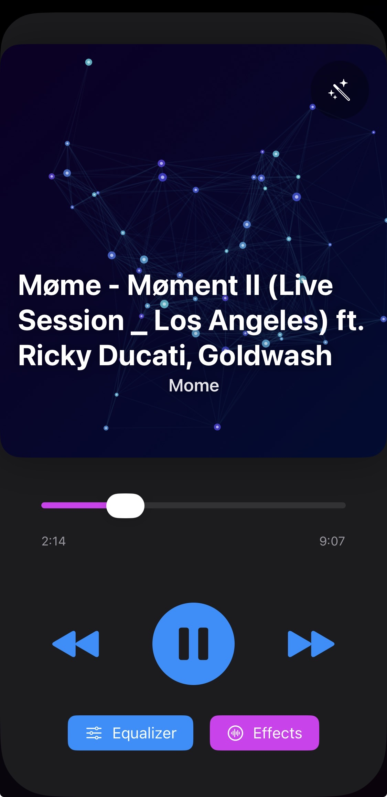
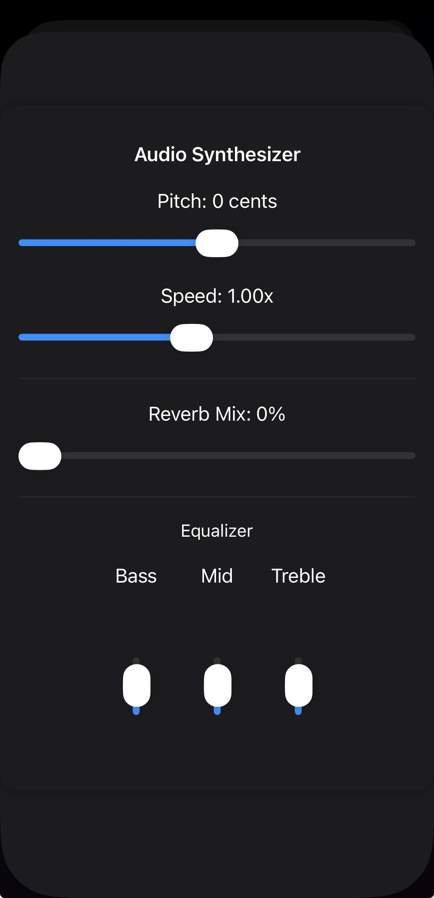
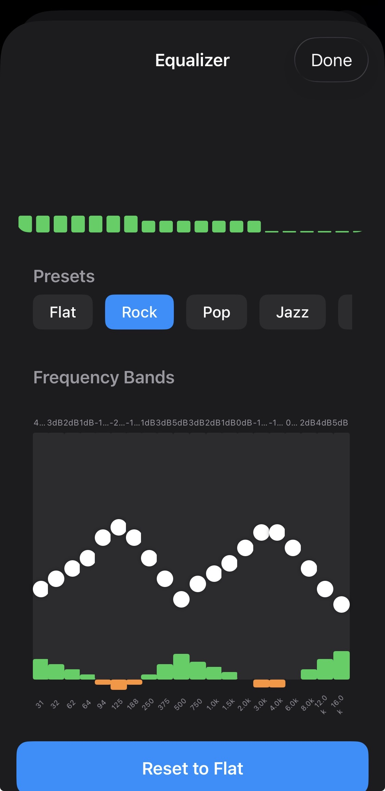
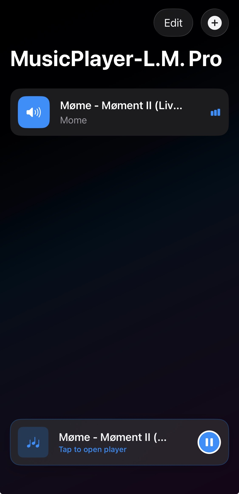

# MusicPlayer-L.M. Pro 🎵

<p align="center">
  
  <br>
  <b>A professional, local iOS music player built with Swift and SwiftUI.</b>
</p>

---

## 📸 Screenshots

<p align="center">
  
  
  
  
</p>

---

## ✨ Features

*   **Audio Engine**: High-fidelity playback using `AVAudioEngine`.
*   **Visualizers**: Three distinct, randomized themes:
    *   🌆 **Synthwave 80s**
    *   🌈 **Tie-Dye**
    *   ✨ **Particle Constellation**
*   **Equalizer**: Professional 20-band equalizer with presets (Rock, Pop, Jazz, etc.).
*   **Effects**: Real-time Pitch, Speed, and Reverb controls.
*   **Metadata Editor**: Edit artist names directly within the app context menu.
*   **Privacy**: Fully offline, no data collection.

## 🚀 How to Install

### Option 1: Using Xcode (Free)
1.  **Download** this repository (Code -> Download ZIP) or clone it.
2.  Open `MusicPlayer-LM.xcodeproj` in **Xcode** (Mac only).
3.  Connect your iPhone via USB.
4.  Select your phone in the top-left device selector.
5.  Press **Cmd+R** (or the Play button) to build and install.
6.  *Note:* You may need to go to **Settings -> General -> VPN & Device Management** on your phone to "Trust" the app after installing.

### Option 2: App Store Deployment
If you are the developer deploying this app:
1.  Ensure you have a paid Apple Developer Account.
2.  Run the automated build script included in this repo:
    ```bash
    ./build_for_appstore.sh
    ```
3.  Upload the generated `.ipa` file using the **Transporter** app.

## 🛠 Project Structure
*   `Services/`: `AudioEngineManager` (Core Audio) & `LibraryManager` (File Access).
*   `ViewModels/`: `PlayerViewModel` (Logic) & `EqualizerViewModel`.
*   `Views/`: SwiftUI Interfaces (`PlayerView`, `LibraryView`, `EqualizerView`).
*   `Models/`: Data structures (`Song`, `EqualizerPreset`).

## ⚠️ Important Note on Signing
This project uses **Automatic Signing**.
*   **Team ID**: If building via command line, ensure your Apple Developer Team ID is set in Xcode.
*   **Bundle ID**: `DevSwap.MusicPlayer-LM`.

## Privacy
This app does not collect data. It only reads audio files you explicitly select via the system document picker.

---
*Created by Matthew Lopez*
